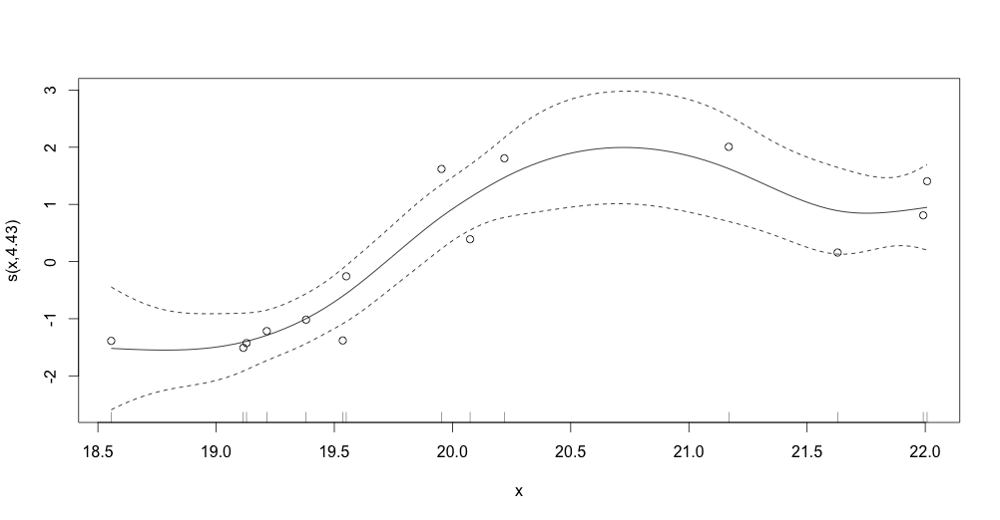

01/07/15
===
- Work on missing 5-7 Mb genomes from model genomes to calculate the deviation. Reproduce SDM for all the small genomes 
- Contig size analysis 
	- Linear regresion of log(N50) vs log(Genome size) with confidence intervals 
	- Probability N50 vs genome length. Figure it out. 
- Write SDM results for NGS reads, and  README files for all the folders in Git. Remake qqplots 


02-03/07/15
===
- Make SDM workflow for preprint
- Work on poster for NoCass

07-08/07/15
===
- Create Alignment folders in tsl/data/plants/arabidopsis to keep sam, bam, pileup and vcf files from alignments. Move those files from scratch to that folders. 
- Work on poster for NoCass
- Work on methods
- Run SDM with model genomes based on the NGS data with 10kb contigs (closer to reality). Plot sizes of contigs in those genomes, they oscillate between 10000 bp and 20000 bp. Found mutation succesfully with all the filters. 
- Try to find a relationship between N50 contig length and genome size from the genome assemblies chosen. 


I try to fit a model to the data.  The relationship is non-linear, so first I tried with a quadratic model 

```
###different lines per colour (technology)
grid <- with(df_logs, expand.grid(
  x = seq(min(x), max(x), length = 23),
  colour = levels(factor(colour))
))
grid$y <- stats::predict(model, newdata=grid)
qplot(x, y, data=df_logs, colour=factor(colour)) + geom_line(data=grid)
err <- stats::predict(model, newdata=grid, se = TRUE)
grid$ucl <- err$fit + 1.96 * err$se.fit
grid$lcl <- err$fit - 1.96 * err$se.fit
qplot(x, y, data=df_logs, colour=factor(colour)) +
  geom_smooth(aes(ymin = lcl, ymax = ucl), data=grid, stat="identity")
 ```


```
x2 <- x^2
model <- lm(y ~ x + x2)
quadratic.model <- lm(y ~ x + x2)
summary(quadratic.model)
points(x,y-mean(y))
```
```
fit2 <- lm(df_logs$y ~ poly(df_logs$x, 2, raw=TRUE))
fit3 <- lm(df_logs$y ~ poly(df_logs$x, 3, raw=TRUE))
summary(fit2) ##r square = 0.5631
summary(fit3) ##r square = 0.5848
```


but the r2 was always very low, so I coudn't define a relationship.

The relationship is not linear but I don't have any theory or any mechanistic mdel to describe the relationship, so I used GAMs (Generalized Additive Models) to fit non-parametric smoothers to the data without require us to specify a particular model. When I used it on the Illumina HiSeq assemblies and those genomes larger than 200 Mb,  the r square (0.807) and p-value (0.000909) were not bad. With all the assemblies the r square value was very low, so I couldn't define a strong relationship. 

```
x <- log(illumina[illumina$Sequence_lengths > 20000000,]$Sequence_lengths)
y <- log(illumina[illumina$Sequence_lengths > 20000000,]$N50_contig)
```

```
library(mgcv)
model <- gam(y ~ s(x))
summary(model)
plot(model)
points(x,y-mean(y))
```



09/07/15
===

- Create folder for BAM files to put in Git. Ler reads (parental for OCF2) are missing, so I'm repeating the mapping. 
- Rearrange files and folders so they are accesible in the cluster. 
- Work on poster